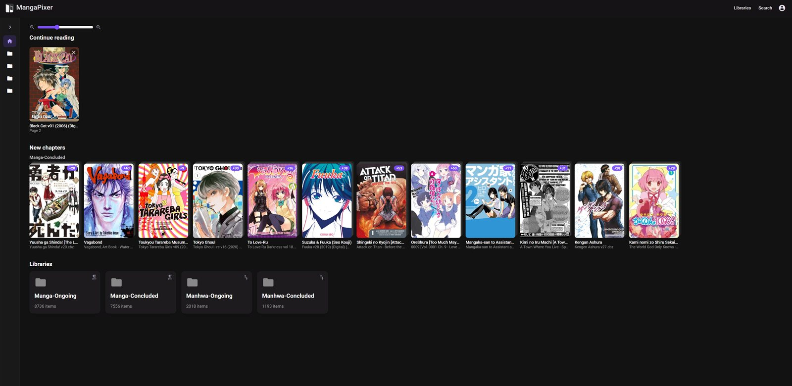
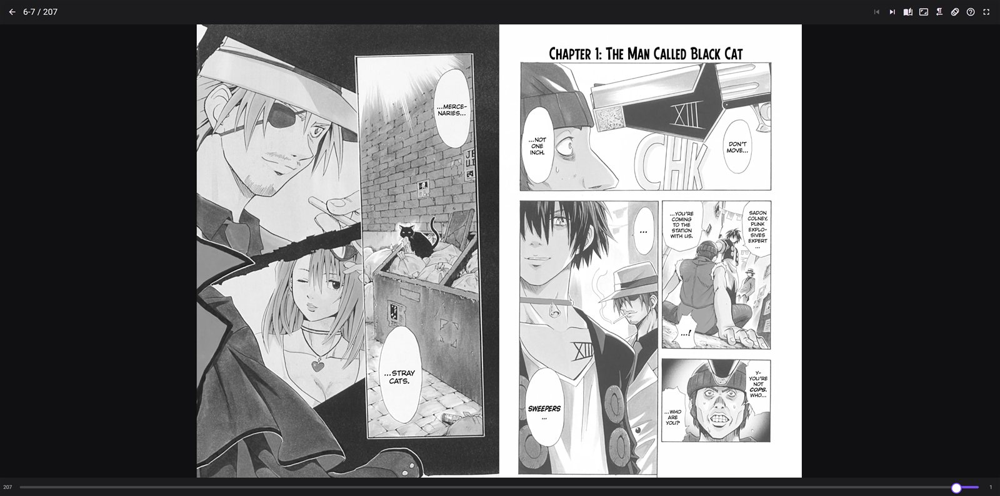
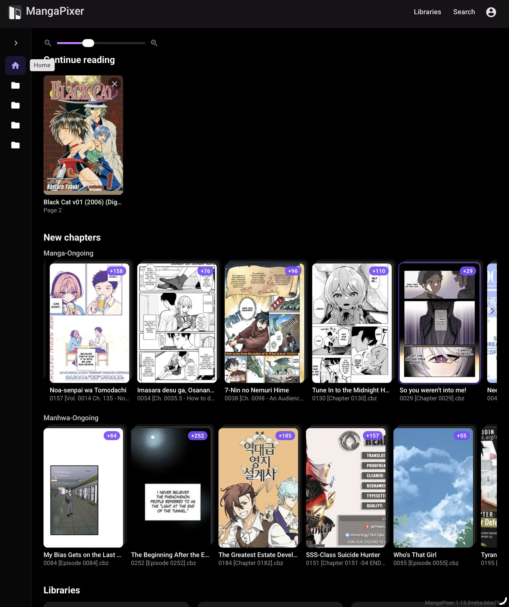

<p align="center"></p>

# MangaPixer

**A self-hosted, multi-user, folder-native manga and comic library server with a web reader. Also works standalone on Windows!**

[](https://github.com/dixit92/mangapixer/releases) [](LICENSE) [](https://github.com/dixit92/mangapixer/actions/workflows/ci.yml)

MangaPixer serves your existing manga and comic folders to any browser.

You point it at the directories where your `.cbz` and `.cbr` files already live, and it builds a catalog, generates thumbnails, and gives every user on your server their own reading progress, read marks and "continue reading" shelf. You can have multiple libraries for different types of content (manga, webcomics, graphic novels, etc.) and each folder can have independent properties set (such as reading direction).

Inspired by several great comic servers and readers developed by the community, MangaPixer's main goals are:
- Folder-native. It doesn't enforce a library structure on you. Similar to [YACReader](https://www.yacreader.com/), but with...
- Multi-user support. You can create admin or "normal" users, and admins can expose specific libraries to normal users. Each user has their own reading progress, and users don't interfere with each other.
- Good native web support. I'm trying to offer as good a reading experience as possible across desktop, iPad/tablet and smartphone without needing an app. An app is to follow later so that you can save and download reliably.
- No metadata required. If you have libraries with populated metadata, I'd recommend checking out [Kavita](https://www.kavitareader.com/) or [Komga](https://komga.org/).
- You can also allow users to mark libraries as "private" and hide them from the default view. Might be useful...

### What "folder-native" means

- **Your folders are the library.** Nothing is imported, copied or reorganized. The folder tree you already have *is* the browse tree: series folders, volume sub-folders, loose archives. Whatever.
- **Source media is never modified.** MangaPixer never writes, renames, moves, deletes, tags or extracts into your library folders. The container mounts them read-only (`:ro`). Everything MangaPixer creates (database, thumbnails, page cache, scratch space) lives in its own data directories.
- **Moves don't lose your place.** When a rescan finds that an archive was moved or renamed (one missing file and one new file with the same size and content signature), reading state follows the file.

Why folder-native? Because I wanted a way to organize my content freely and not have to do a lot of library management, as long as I understood where everything was. And you might want to do the same.

## Screenshots

| Home on desktop | Reader, double-page mode |
|---|---|
|  |  |

| Home on a tablet | Reader on a phone |
|---|---|
|  |  |

## Quick start (Docker Compose)

You need Docker with Compose v2. The Compose file pulls the published image from the GitHub Container Registry. Full guide: [Install with Docker](docs/install-docker.md).

1. Clone the repository, or download just `deploy/compose.yaml` into a folder.
2. Mount your libraries read-only in a `deploy/compose.override.yaml` (git-ignored):

   ```yaml
   services:
     mangapixer:
       volumes:
         - /path/to/your/manga:/media/manga:ro
         - /path/to/your/comics:/media/comics:ro
   ```

3. From that folder, pull and start the version you want (see [Releases](https://github.com/dixit92/mangapixer/releases)):

   ```bash
   export MANGAPIXER_VERSION=1.22.2
   docker compose -f deploy/compose.yaml -f deploy/compose.override.yaml up -d
   ```

4. Open <http://127.0.0.1:8080>, create the first admin account on the setup screen, then add a library under **Administration** and scan it.

The port is published on loopback only; put a [reverse proxy](docs/reverse-proxy-and-https.md) in front for other devices. Your database, keys, backups and thumbnails live in the `mangapixer-data` volume: back that one up. To upgrade, set `MANGAPIXER_VERSION` to the new version, run `pull` and then the same `up -d`; schema upgrades run at startup after an automatic backup. Building from source is one overlay away: see the Docker guide.

**Unraid:** `deploy/compose.unraid.yaml` uses a single appdata folder and `PUID`/`PGID`. See [Install on Unraid](docs/install-unraid.md).

**Windows:** a native tray app with a per-user MSI installer, no Docker needed. Download `MangaPixer-<version>-windows-x64.msi` from [Releases](https://github.com/dixit92/mangapixer/releases); see [Install on Windows](docs/install-windows.md).

[FAQ - in case you're in a hurry](docs/faq.md)

## Features

**Library and browsing**

- Browse the folder hierarchy in a card view (with a card-size slider) or a list view.
- Sort by name (ascending or descending), recently added, recently read, or recently updated. Recently updated ranks a folder by its newest archive, like a new chapter.
- Filter by read state (reading / read / unread) at any folder level. The filter also applies to series folders through their contents, and you can hide empty folders.
- A-Z jump rail with multilingual collation, infinite scroll in both directions after a jump, and read/reading rollup badges on folders. This means you can tell at a glance whether a folder contains only comics you've read, some you haven't read yet, or nothing you've started at all.
- Multi-select, including shift/ctrl ranges and touch long-press, to mark items read or unread in bulk. Works on touchscreens too!
- Full-text search over titles and folder names (trigram search), with cover thumbnails and a folder-vs-archive badge.

**Reader**

- Four modes: paged left-to-right, paged right-to-left (manga), double-page spreads, and vertical webtoon scrolling. Admins set a default mode per library and per folder, and each user can override it per item or set a personal default.
- Double-page mode adapts: it shows a single page in narrow portrait, keeps wide spreads whole, and shows both page numbers.
- Touch and keyboard navigation: direction-aware swipe zones, arrow keys, a draggable page scrubber, a help overlay (`?`), and immersive fullscreen.
- Webtoon tap zones and swipe move by a configurable step (90% of the screen by default). Turn them off for free scrolling only.
- Configurable page-turn animation (Slide / Reveal / None).
- Auto-advance to the next or previous chapter (or whatever your archive is), plus page prefetch around the current position.

**Per-user reading state**

- Each user has their own progress, read marks and "Continue reading" row. You can dismiss items from the row, and finished ones hide automatically.
- A "Start reading" / continue shortcut on each folder that opens the next unread item.
- Optional "always open read items from the start" preference.

**Home**

- "Continue reading": one row across all your libraries.
- "New chapters": recently added archives, grouped by library and stacked per top-level folder (latest chapter plus a "+N" badge). Each user chooses the time window in days (30 by default) and which libraries contribute.
- A grid of your libraries.

**Multi-user, privacy and access**

- No default credentials. A fresh instance shows a first-run setup screen, and the first admin account is created there (see [First-run setup](docs/users-and-access.md#first-run-setup)).
- Admin and reader roles, with per-user library access grants.
- Onboard users with a password, or with a single-use activation link that expires after 48 hours so the user sets their own password.
- **Private libraries and Incognito:** each user can mark libraries as private. While Incognito is on (the default for every new browser session), private libraries are hidden from browse, home and search.
- Login rate limiting, CSRF protection on authenticated state-changing requests, forced password change, per-user session revocation, and last-admin protection.

**Administration and operations**

- Add, rename and remove libraries from the web UI, using a folder picker confined to the media root. Removing a library deletes only MangaPixer's own metadata and thumbnails; your files are untouched.
- Scans run per library or across all libraries, and can be canceled. Each library is also rescanned automatically on its own schedule (daily by default; hourly, every 6 hours, weekly or off). There is no filesystem watching yet.
- Persistent thumbnails that survive restarts and cache clears. A background backfill fills them in and yields to active readers. Thumbnails can be regenerated per library.
- Automatic rotating database backups (daily, 7 kept by default) and on-demand backups. A validated backup can be uploaded for restore; it is applied atomically on the next restart, with rollback if that fails (see [Backup and restore](docs/backup-and-restore.md)).
- Runtime log-level control (global and per subsystem) and a diagnostics export.
- YACReader progress import: if a library folder contains a YACReader library database, an admin can preview its read progress and import it into their own account. The YACReader data is only read.
- Health endpoints (`/health`, `/health/ready`) and an OpenAPI document at `/openapi/v1.json` (the checked-in contract is `contracts/openapi.json`).
- Web app manifest and icons, so MangaPixer can be added to a phone or tablet home screen.

## Supported formats

| | Formats |
|---|---|
| Archives | ZIP (`.cbz`, `.zip`), RAR 4 and RAR 5 (`.cbr`, `.rar`) |
| Page images | JPEG, PNG, WebP, AVIF, GIF, BMP, TIFF |

Archives are read in place by a managed library (no external `7z` or `unrar` binary), and pages are decoded in a separate, supervised worker process so a malformed file cannot take the server down. Not supported yet: **solid RAR and 7-Zip archives** (scanned and listed, but the reader cannot open them; repack them as `.cbz`), PDF, EPUB, CBT and folders of loose images. Details: [Supported archive formats](docs/library-layout.md#supported-archive-formats).

## Documentation

All guides live in [`docs/`](docs/README.md):

- **Install:** [Docker](docs/install-docker.md), [Unraid](docs/install-unraid.md), [Windows](docs/install-windows.md)
- **Set up and run:** [Configuration reference](docs/configuration.md), [Library layout](docs/library-layout.md), [Users and access](docs/users-and-access.md), [Backup and restore](docs/backup-and-restore.md), [Reverse proxy and HTTPS](docs/reverse-proxy-and-https.md)
- **Use:** [Reader](docs/reader.md)
- **Help:** [Troubleshooting](docs/troubleshooting.md), [FAQ](docs/faq.md)

## Configuration

Settings follow ASP.NET Core conventions: `appsettings.json` or environment variables, with `:` written as `__`. The ones most self-hosters touch are the storage roots (`MangaPixer__Storage__DataRoot`, `CacheRoot`, `ScratchRoot`; the image sets `/data`, `/cache`, `/scratch`), `MangaPixer__Storage__MediaRoot` (the folder the admin picker may browse, `/media` by default) and `MangaPixer__Media__MaxConcurrentJobs` (set `1` on a low-memory NAS). Log verbosity is changed at runtime from the Administration page. Every key, with defaults, is in the [configuration reference](docs/configuration.md).

## Privacy and security

- **No telemetry, analytics or phone-home.** Fonts and icons are bundled and served by your own server, never from a CDN.
- **Logs never contain paths or titles**, only IDs, counts, timings and sanitized error codes. Reader-facing API responses never contain filesystem paths.
- **Source media is read-only**, enforced by the code and by the `:ro` mounts.
- **No default credentials.** The first admin is created by you on the setup screen, and that endpoint refuses once any user exists.
- Session cookies use ASP.NET Core Data Protection; the keys live in `<DataRoot>/keys`, so treat the data volume as sensitive.

To report a vulnerability, see [SECURITY.md](SECURITY.md).

## Building from source

The toolchain is .NET SDK 10.0.4xx, Node.js 24 and PowerShell 7, or the official SDK containers if you have none of them installed. Build, test and verification commands, the repository layout and how to run a local instance are in [CONTRIBUTING.md](CONTRIBUTING.md).

## Contributing

Issues and suggestions are welcome. Before opening a pull request, read [CONTRIBUTING.md](CONTRIBUTING.md), run `pwsh ./scripts/Verify-Quick.ps1`, and keep to the invariants in [`AGENTS.md`](AGENTS.md): source media stays read-only, no personal data in tracked files, no default credentials, and every new service is wired and tested through its public surface. Agentic development is welcome, but know what you're doing. 

## License

MangaPixer is released under the [MIT License](LICENSE). Copyright (c) 2026 Lifepixer LLC. Third-party components and their licenses are listed in [THIRD-PARTY-NOTICES.md](THIRD-PARTY-NOTICES.md).
