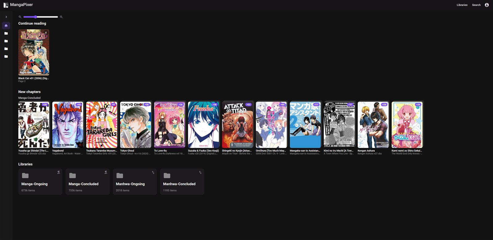
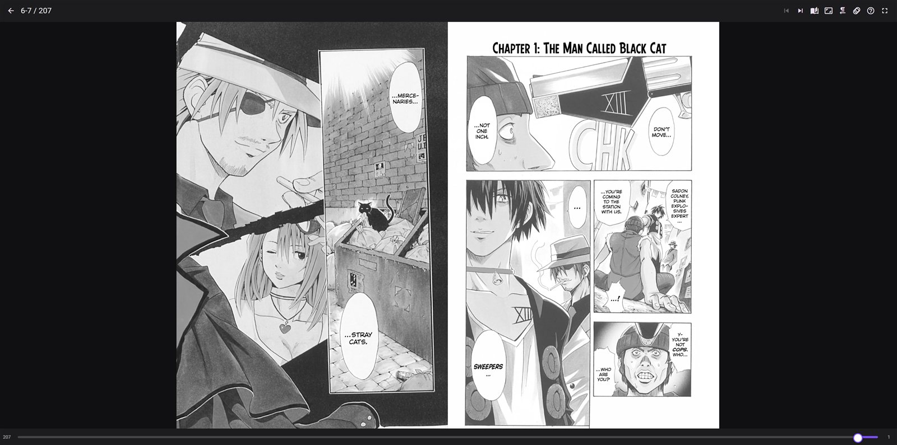
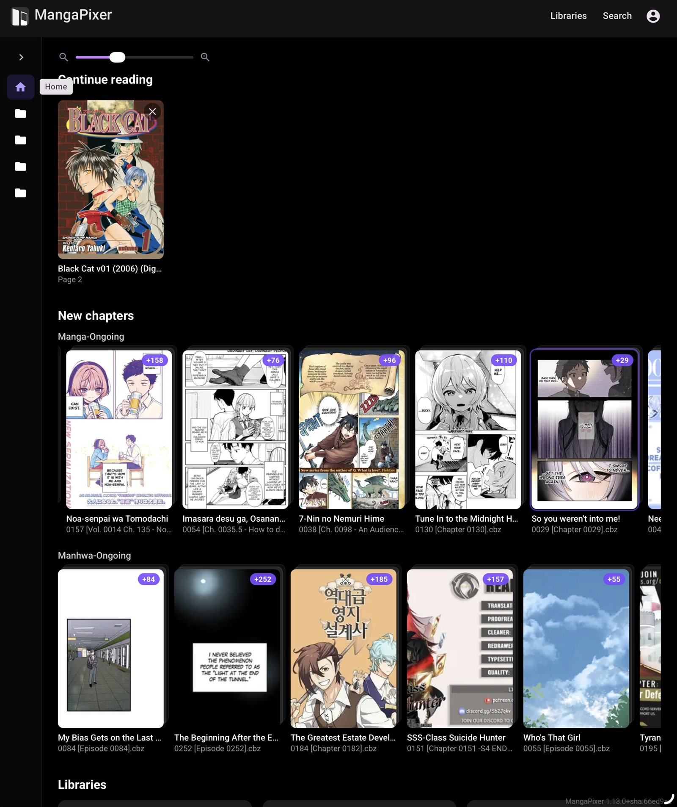

<p align="center"></p>

# MangaPixer

**A self-hosted, multi-user, folder-native manga and comic library server with a web reader. Also works standalone on Windows!**

[](https://github.com/dixit92/mangapixer/releases) [](LICENSE) [](https://github.com/dixit92/mangapixer/actions/workflows/ci.yml)

MangaPixer serves your existing manga and comic folders to any browser.

You point it at the directories where your `.cbz` and `.cbr` files already live, and it builds a catalog, generates thumbnails, and gives every user on your server their own reading progress, read marks and "continue reading" shelf. You can have multiple libraries for different types of content (manga, webcomics, graphic novels, etc.) and each folder can have independent properties set (such as reading direction).

Inspired by several great comic servers and readers developed by the community, MangaPixer's main goals are:
- Folder-native. It doesn't enforce a library structure on you. Similar to [YACReader](https://www.yacreader.com/), but with...
- Multi-user support. You can create admin or "normal" users, and admins can expose specific libraries to normal users. Each user has their own reading progress, and users don't interfere with each other.
- Good native web support. I'm trying to offer as good a reading experience as possible across desktop, iPad/tablet and smartphone without needing an app. An app is to follow later so that you can save and download reliably.
- No metadata required, but used when it's there. Folder and file names are enough to browse and read. MangaPixer also reads the `ComicInfo.xml` inside your archives, and an admin can optionally link series to [MangaUpdates](https://www.mangaupdates.com) for descriptions, authors and cover art, by hand or automatically (off by default). If your library is organized around metadata first, I'd still recommend checking out [Kavita](https://www.kavitareader.com/) or [Komga](https://komga.org/).
- You can also allow users to mark libraries as "private" and hide them from the default view. Might be useful...

### What "folder-native" means

- **Your folders are the library.** Nothing is imported, copied or reorganized. The folder tree you already have *is* the browse tree: series folders, volume sub-folders, loose archives. Whatever.
- **Source media is never modified.** MangaPixer never writes, renames, moves, deletes, tags or extracts into your library folders. The container mounts them read-only (`:ro`). Everything MangaPixer creates (database, thumbnails, page cache, scratch space) lives in its own data directories.
- **Moves don't lose your place.** When a rescan finds that an archive was moved or renamed (one missing file and one new file with the same size and content signature), reading state follows the file.

Why folder-native? Because I wanted a way to organize my content freely and not have to do a lot of library management, as long as I understood where everything was. And you might want to do the same.

## Screenshots

| Home on desktop | Reader, double-page mode |
|---|---|
|  |  |

| Home on a tablet | Reader on a phone |
|---|---|
|  |  |

## Quick start

### Unraid

MangaPixer is in Community Applications. Open the **Apps** tab, search for **MangaPixer**, click **Install**, point **Media** at your manga or comics share (it is mounted read-only), and click **Apply**. Then open `http://<unraid-ip>:6266` and create the first admin account. Details: [Install on Unraid](docs/install-unraid.md).

### Windows

Download `MangaPixer-<version>-windows-x64.msi` from [Releases](https://github.com/dixit92/mangapixer/releases) and run it; no Docker needed. Double-click the MangaPixer tray icon to open the app, then create the first admin account. Details: [Install on Windows](docs/install-windows.md).

### Docker Compose

Download [`deploy/compose.yaml`](deploy/compose.yaml), add your libraries read-only in a `compose.override.yaml` next to it:

```yaml
services:
  mangapixer:
    volumes:
      - /path/to/your/manga:/media/manga:ro
```

then start it and open <http://127.0.0.1:8080> to create the first admin account:

```bash
MANGAPIXER_VERSION=1.25.0 docker compose -f compose.yaml -f compose.override.yaml up -d
```

Details, upgrades and reaching it from other devices: [Install with Docker](docs/install-docker.md).

In every case, add your libraries under **Administration** after signing in. In a hurry? See the [FAQ](docs/faq.md).

## Features

- **Folder-native library:** card and list views, sorting, read-state filters, an A-Z rail, bulk read marks and full-text search.
- **A reader for every screen:** paged (left-to-right or manga), double-page spreads and vertical webtoon, with touch and keyboard controls and on-device upscaling (**Crisp** and **Enhance**).
- **Per-user reading state:** progress, read marks, "Continue reading" and "New chapters" for every user.
- **Series information:** read from `ComicInfo.xml`, and optionally from MangaUpdates, linked by hand or automatically (off by default).
- **Multi-user:** admin and reader roles, per-library access, activation links, private libraries and Incognito.
- **Low-maintenance:** scheduled scans, persistent thumbnails, automatic database backups, and YACReader progress import.
- **Formats:** ZIP (`.cbz`, `.zip`) and RAR (`.cbr`, `.rar`) with JPEG, PNG, WebP, AVIF, GIF, BMP or TIFF pages. Solid RAR and 7-Zip archives, PDF and EPUB are not supported yet.

The full list is in [Features](docs/features.md).

## Documentation

All guides live in [`docs/`](docs/README.md):

- **Install:** [Unraid](docs/install-unraid.md), [Windows](docs/install-windows.md), [Docker](docs/install-docker.md)
- **Set up and run:** [Configuration reference](docs/configuration.md), [Library layout](docs/library-layout.md), [Users and access](docs/users-and-access.md), [Backup and restore](docs/backup-and-restore.md), [Reverse proxy and HTTPS](docs/reverse-proxy-and-https.md)
- **Use:** [Features](docs/features.md), [Reader](docs/reader.md), [Series information](docs/series-information.md)
- **Help:** [Troubleshooting](docs/troubleshooting.md), [FAQ](docs/faq.md), [Privacy and security](docs/privacy-and-security.md)

## Privacy and security

No telemetry, analytics or phone-home, and no default credentials. Your media folders are only ever read, and logs never contain paths or titles.

### What leaves your server

Nothing until an admin turns it on: the Update Checker and [MangaUpdates](https://www.mangaupdates.com) lookups are both optional and off by default. Details: [Privacy and security](docs/privacy-and-security.md). To report a vulnerability, see [SECURITY.md](SECURITY.md).

## Contributing

Issues and suggestions are welcome. [CONTRIBUTING.md](CONTRIBUTING.md) covers building from source, the toolchain and the repository layout. Before opening a pull request, run `pwsh ./scripts/Verify-Quick.ps1`, and keep to the invariants in [`AGENTS.md`](AGENTS.md): source media stays read-only, no personal data in tracked files, no default credentials, and every new service is wired and tested through its public surface. Agentic development is welcome, but know what you're doing.

## License

MangaPixer is released under the [MIT License](LICENSE). Copyright (c) 2026 Lifepixer LLC. Third-party components and their licenses are listed in [THIRD-PARTY-NOTICES.md](THIRD-PARTY-NOTICES.md).
