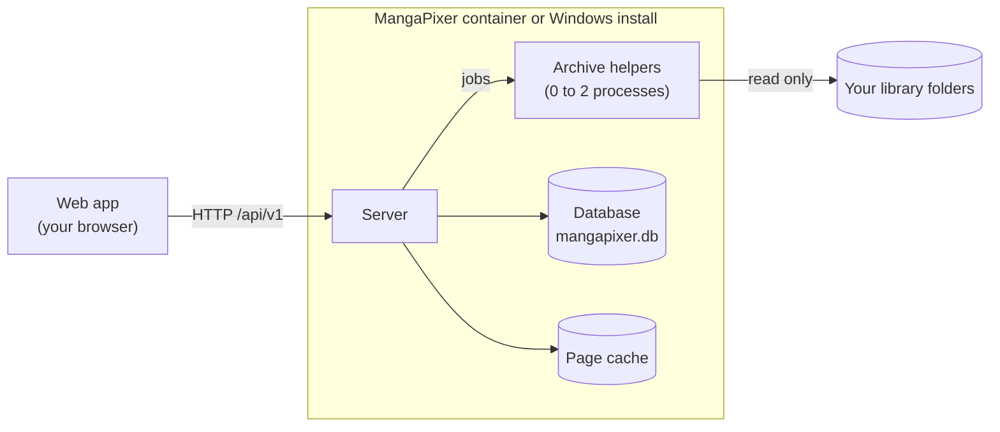

# How MangaPixer works

This page explains what MangaPixer does behind the scenes: which parts run, where your data goes, and why it stays fast. It is written for people who run the server and want to understand what they are looking at. Contributors will find pointers into the source at the end.

## The parts

- **The web app** runs in your browser. It is downloaded from your own server, including its fonts and icons, so it never contacts anyone else.
- **The server** answers every request from the web app, keeps the catalog of your libraries, and decides what work happens when.
- **The archive helpers** are small separate processes. They are the only part that opens your archives and decodes images. Keeping that work out of the server means a broken or unusual archive can at worst crash a helper, which the server replaces, and never the server itself.

The server talks to its helpers over a private pipe (their standard input and output), not over the network.

## Where your data goes

MangaPixer keeps its own files in three places, and only ever *reads* your library folders:

| Place | What is in it | Keep it safe? |
|---|---|---|
| **Data** (`/data`, or `/config/data` on Unraid) | The database, sign-in keys, logs, backups, and cover thumbnails | **Yes.** This is what to back up. |
| **Cache** (`/cache`) | Page images already extracted from archives | No. Deleting it only makes the next reads a little slower. |
| **Scratch** (`/scratch`) | Files that exist for a moment while a page is extracted, and YACReader imports | No. |

See [Configuration](configuration.md#storage) for the settings and size limits, and [Library layout](library-layout.md#read-only-guarantee) for how the read-only guarantee is enforced.

### The database

Everything MangaPixer knows is in one SQLite file, `mangapixer.db`: your libraries, folders and archives, users, reading progress, read marks, bookmarks, favorites and settings. There is no database server to install.

The catalog part of the database (which folders and archives exist) is a mirror of your folders, rebuilt by scanning. The personal part (progress, marks, favorites, accounts) exists nowhere else, which is why the server backs the database up for you (see [Backup and restore](backup-and-restore.md)).

The database is set up so that reading and browsing never wait for a scan: a scan writes in the background while everyone else keeps reading the last complete state. Changes to reading progress are written to disk immediately, so a power cut does not lose your place.

## What happens when you scan a library

A scan compares your folders with the catalog:

1. The server walks the library folder and lists every supported archive and folder. It does not open the archives yet, so a scan of a large library takes seconds to minutes rather than hours.
2. New entries are added, changed files are marked for re-analysis, and missing ones are removed. Changes are saved in large batches rather than one by one.
3. Moved or renamed archives are recognized by a fingerprint of their contents, so they keep their reading progress (details in [Library layout](library-layout.md#rescans-moves-and-deletions)).
4. **Analysis** then runs in the background: a helper opens each new archive, lists its pages in natural order, and records whether it can be read. Covers are made from the first page and stored as small WebP files.

A scan never runs on its own; an admin starts it. If a scan finds that almost every file has vanished, for example because a network share is not mounted, it deletes nothing.

## What happens when you read a page

When the reader asks for a page:

1. The server checks the **page cache**. If the page was extracted before at the same size, it is sent straight away.
2. Otherwise it asks a helper to extract it. **The page you are looking at always goes first**: when more than one helper is allowed, one is held back for readers, and page requests jump ahead of prefetching, which in turn goes ahead of background analysis and cover-making.
3. With **Page quality: Auto** (the default), the reader tells the server how large the page will actually appear on your screen. The helper shrinks the page once to the nearest of a few standard sizes (1080, 1440 or 2160 pixels on the long edge by default), using your chosen [downscale filter](reader.md#image-quality), and saves it as WebP. Shrinking a page once, with a proper filter, looks better than letting the browser squeeze a full-size scan, and it sends far fewer bytes to a phone. Pages are never enlarged on the server.
4. The result goes into the cache, so the next reader of that page at that size gets it instantly. When the cache reaches its size limit (1 GiB by default), the pages nobody has read for the longest time are removed.

Meanwhile the reader **prefetches**: it quietly loads the next few pages (and the previous couple) so that turning a page feels instant. In vertical (webtoon) mode it loads a few pages below where you are scrolling, and each strip page is sized from its own shape, so very tall strips stay sharp.

**Enhance** is different: it runs entirely in your browser, on your device's graphics chip, and only when a page is shown larger than its original resolution. The server is not involved. See [Image quality](reader.md#image-quality).

## Memory and background work

A quiet server does very little:

- The server process itself typically uses 150-300 MB.
- Archive helpers start when there is work and shut down after 3 minutes without any, so an idle server usually runs none. The first page after a quiet spell takes a fraction of a second longer while a helper starts.
- At most two helpers run at once by default. On a small NAS, one is enough (`MangaPixer__Media__MaxConcurrentJobs=1`); if you would rather keep one ready at all times, set `MangaPixer__Media__MinWarmWorkers=1`. See [Configuration](configuration.md#media-processing).

Background work that runs without anyone asking:

| Work | When |
|---|---|
| Analysis of new or changed archives | After a scan, and at start-up for anything left unfinished |
| Missing covers | A pass at every start-up |
| Database backup | 2 minutes after start-up, then on your schedule (daily by default) |
| Cleanup of expired sign-ins | Hourly |
| Page cache trimming | After each write that goes over the limit, and a full pass daily |
| Update check | Only if an admin turned on the Update Checker: at most once a day |

## Privacy by design

- **Nothing leaves your network** unless an admin turns on the Update Checker, which asks GitHub whether a newer release exists and sends nothing about your server. There is no telemetry, analytics or remote font or icon loading, and no metadata lookups.
- **Logs never contain** file or folder paths, titles, passwords, tokens, cookies or client IP addresses (see [Troubleshooting](troubleshooting.md#logs)).
- **Admin pages show counts and times, never titles or paths**, including the Analytics section (see [Users and access](users-and-access.md#analytics)).
- **Your media is never written to.** The server has no code path that writes into a library folder, and the install guides mount media read-only on top of that.

## For contributors: where things live

| Area | Source |
|---|---|
| HTTP API, catalog, scanning, users, backups | `src/MangaPixer.Server` |
| Archive helper process | `src/MangaPixer.MediaWorker` |
| Shared contracts (IDs, DTOs, the helper protocol) | `src/MangaPixer.Core` |
| Windows tray app | `src/MangaPixer.Tray` |
| Web app | `web/` (Angular) |
| API description | `contracts/openapi.json`, also served at `/openapi/v1.json` |

Build and test instructions are in [CONTRIBUTING.md](../CONTRIBUTING.md) and [AGENTS.md](../AGENTS.md).
