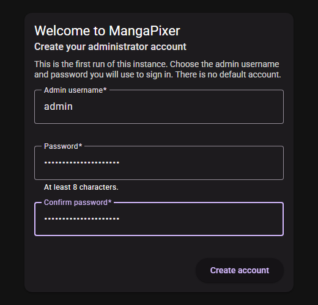
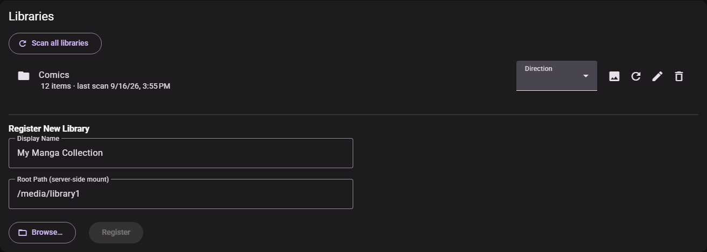

# Install with Docker

This guide walks through `deploy/compose.yaml`, the canonical way to run the server. It works on any Linux host, on a NAS that runs Docker, and on Docker Desktop. For Unraid, see [Install on Unraid](install-unraid.md) instead.

## What you need

- Docker Engine with the Compose plugin (`docker compose`). The override example below uses the `!override` tag, which needs Compose 2.24 or later.
- The two Compose files from this repository (`deploy/compose.yaml` and your own override). The image itself is pulled from the GitHub Container Registry; nothing is built on your machine.
- Your comics or manga in folders that the Docker host can read.

## What the Compose file sets up

| Setting | Value | Why |
|---|---|---|
| Port | `127.0.0.1:8080:8080` | Published on loopback only. Only the Docker host itself can reach the app until you change this or put a [reverse proxy](reverse-proxy-and-https.md) in front. |
| `/data` | named volume `mangapixer-data` | Database, sign-in keys, logs, backups and thumbnails. **This is the volume to back up.** |
| `/cache` | named volume `mangapixer-cache` | Cached page images. Size-limited (1 GiB by default) and safe to delete. |
| `/scratch` | named volume `mangapixer-scratch` | Temporary work folders used while opening archives. Safe to delete. |
| `read_only: true` + `tmpfs: /tmp` | | The container's own filesystem is read-only; only the three volumes and `/tmp` are writable. |
| `no-new-privileges` | | The process cannot gain privileges after start-up. |
| Logging | `local` driver, 20 MB × 5 files | Container output cannot fill your disk. |
| Restart | `unless-stopped` | The server comes back after a reboot or crash. |

The container starts as root only long enough to fix ownership of the state folders, then drops to UID/GID `1000:1000`. You can change that with `PUID` and `PGID` (see [Configuration](configuration.md#container-user)).

Compose names the volumes after the project, which defaults to the folder containing the Compose file. With the commands below the volumes are called `deploy_mangapixer-data`, `deploy_mangapixer-cache` and `deploy_mangapixer-scratch`.

## Step 1: get the Compose file

Either clone the repository, which is also what you need to build from source later:

```sh
git clone https://github.com/dixit92/mangapixer.git mangapixer
cd mangapixer
```

or download just the Compose file into a folder of your choice:

```sh
mkdir -p mangapixer/deploy && cd mangapixer
curl -fsSL -o deploy/compose.yaml https://raw.githubusercontent.com/dixit92/mangapixer/main/deploy/compose.yaml
```

The commands below assume you are in that `mangapixer` folder.

## Step 2: mount your media read-only

The server never writes to your media (see [Library layout](library-layout.md#read-only-guarantee)), and mounting it read-only makes the operating system enforce that too. Keep your real paths out of the tracked Compose file: put them in an override file next to it, `deploy/compose.override.yaml`:

```yaml
services:
  mangapixer:
    volumes:
      - /srv/comics:/media/comics:ro
      - /srv/manga:/media/manga:ro
```

Mount every share somewhere under `/media`. That is the folder the library **Browse…** picker starts in (you can change it with [`MangaPixer__Storage__MediaRoot`](configuration.md#storage)).

Compose only reads the override file when you pass it with `-f`, as in the commands below. The repository's `.gitignore` already excludes `deploy/compose.override.yaml`, so Git never picks it up.

## Step 3: choose the image tag

The Compose file pulls `ghcr.io/dixit92/mangapixer:${MANGAPIXER_VERSION}`. When the variable is unset it falls back to `latest`, which moves with every release; pin the version you want so upgrades happen when you decide. Released versions are listed on the [Releases page](https://github.com/dixit92/mangapixer/releases). In a clone, this script prints the version of the checked-out source:

```sh
pwsh ./scripts/Get-MangaPixerVersion.ps1
```

Then set it in your shell. Set it again in every new shell before you run `docker compose`, or Compose looks for an image under the fallback tag.

```sh
export MANGAPIXER_VERSION=1.22.0          # bash / zsh
```

```powershell
$env:MANGAPIXER_VERSION = "1.22.0"         # PowerShell
```

## Step 4: start

```sh
docker compose -f deploy/compose.yaml -f deploy/compose.override.yaml up -d
```

The first start pulls the image (about 600 MB compressed). Later starts reuse it.

Check that the server is up:

```sh
curl http://127.0.0.1:8080/health
```

It answers `Healthy`. The image also has a Docker health check that calls the same endpoint every 30 seconds, so `docker compose -f deploy/compose.yaml ps` shows `(healthy)` once start-up finishes.

## Step 5: create the admin account

There is **no default username or password.** A new server has no users at all.

Open `http://127.0.0.1:8080` in a browser. The **Welcome to MangaPixer** setup screen appears. Choose an **Admin username** and a **Password**, confirm it, and select **Create account**. You are signed in as the first admin.

- Passwords need at least 8 characters, including at least one lowercase letter.
- Usernames can contain letters, digits and `- . _ @ +`. No spaces.

The setup screen only works while the server has no users. After the first account exists, the setup endpoint refuses every request, so nobody can use it to create a second admin.



## Step 6: add a library

1. Open the account menu and choose **MangaPixer Administration**.
2. In the **Libraries** card, under **Register New Library**, enter a **Display Name** and a **Root Path (server-side mount)**, for example `/media/comics`. **Browse…** lets you pick a folder under `/media` instead of typing it.
3. Select **Register**.
4. Select the **Scan now** button (the circular-arrow icon) on the new library's row. Registering a library does not scan it, and the server never scans on its own; you start every scan. See [Library layout](library-layout.md#rescans-moves-and-deletions).



New users you create see no libraries until you give them access. See [Users and access](users-and-access.md).

## Reaching the server from other devices

The default port mapping only listens on `127.0.0.1`. You have two options:

- **Recommended:** keep the loopback binding and run a reverse proxy on the same host that adds HTTPS. See [Reverse proxy and HTTPS](reverse-proxy-and-https.md).
- **LAN only, plain HTTP:** replace the port list in your override file. The `!override` tag replaces the list instead of adding to it:

  ```yaml
  services:
    mangapixer:
      ports: !override
        - "8080:8080"
  ```

The server always listens on port 8080 inside the container. To use a different host port, change only the left-hand number (for example `"127.0.0.1:8181:8080"`).

## Upgrading

1. Set `MANGAPIXER_VERSION` to the new version from the Releases page (and `git pull` if you keep a clone, so the Compose files match).
2. Pull and restart:

   ```sh
   docker compose -f deploy/compose.yaml -f deploy/compose.override.yaml pull
   docker compose -f deploy/compose.yaml -f deploy/compose.override.yaml up -d
   ```

Your volumes are kept. On start-up the server upgrades the database schema if the new version needs it. **Before it changes an existing database it writes a snapshot** called `pre-migration-<UTC timestamp>.db` to `/data/backups`. If that snapshot fails, the server refuses to start rather than risk your data. Automatic backup rotation never deletes these snapshots; only the newest 3 pre-migration snapshots are kept.

Each version is its own image tag, so the previous image stays on disk. Once the new version is running, you can remove old ones with `docker image rm ghcr.io/dixit92/mangapixer:<old-version>`.

## Building from source

Contributors and anyone who wants to run an unreleased commit add the build overlay, which builds the image from the clone under the same name the canonical file pulls:

```sh
docker compose -f deploy/compose.yaml -f deploy/compose.build.yaml -f deploy/compose.override.yaml up -d --build
```

The build is fully containerized (no .NET or Node.js needed on the host); the first one downloads the SDK base images and takes several minutes. Set `MANGAPIXER_VERSION` to the version in `Version.props` (`pwsh ./scripts/Get-MangaPixerVersion.ps1` prints it) so the local image does not shadow a released tag.

## Where backups land

The server writes its own database snapshots to `/data/backups` in the `mangapixer-data` volume: a rotating one every 24 hours (newest 7 kept) plus one-off snapshots before schema upgrades and restores. What they contain, how to copy them out, how to restore one and how to change the schedule are all in [Backup and restore](backup-and-restore.md).

To keep the rotating snapshots on another disk, add a writable bind for them, for example `- /srv/archive/mangapixer-backups:/backups` under `volumes:` (owned by `1000:1000`), then choose **Custom folder** `/backups` in **Administration** > **Backup settings**. `deploy/compose.yaml` has a commented example. The pre-migration and pre-restore snapshots stay in `/data/backups`.

## Stopping and removing

```sh
docker compose -f deploy/compose.yaml -f deploy/compose.override.yaml down
```

`down` keeps the volumes. `down -v` **deletes them**, including your database and backups. Copy `/data/backups` out first if you ever do that.
