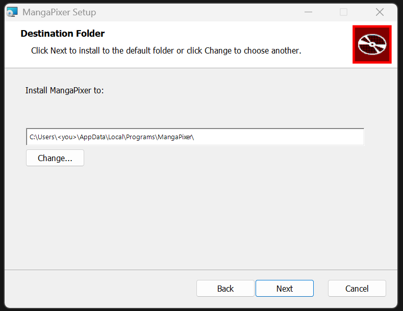
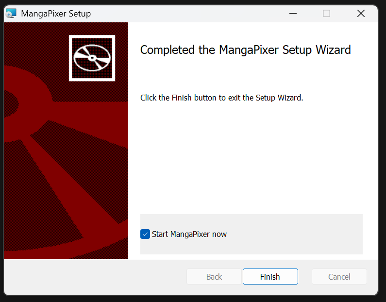
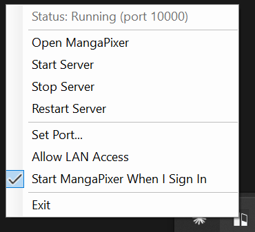

# Install on Windows

Since 1.13.0 MangaPixer runs natively on Windows, without Docker. You install it once with a small installer, and a **tray app** then runs the server for you in the background: it starts the server, watches its health, opens the app in your browser, and stops the server when you exit. Everything lives in your own user profile, so no administrator rights are needed.

If you would rather run the container on Windows, Docker Desktop works too; follow [Install with Docker](install-docker.md) instead.

## What you need

- 64-bit Windows 10 or Windows 11. The package is self-contained, so you do not need to install .NET.
- About 400 MB of disk space for the program, plus room for the database, thumbnails and page cache (see [Where your data lives](#where-your-data-lives)).
- Your comics or manga in folders your Windows user can read: a local drive, an external drive, or a network share.

## Step 1: run the installer

Download `MangaPixer-<version>.msi` from the [Releases page](https://github.com/dixit92/mangapixer/releases) (each release also lists its SHA-256) and run it. The installer is not code-signed yet, so Windows may show a SmartScreen warning the first time; choose **More info** > **Run anyway**.

The wizard shows the license, lets you change the install folder, installs, and offers **Start MangaPixer now** on the last page. Defaults:

| | Default |
|---|---|
| Install folder | `%LOCALAPPDATA%\Programs\MangaPixer` (your profile, no elevation) |
| Start menu | A **MangaPixer** shortcut |
| Start at sign-in | On. The tray app starts when you sign in to Windows. |

To install without the wizard, for example from a script:

```powershell
msiexec /i MangaPixer-1.14.1.msi /qn                 # silent, defaults
msiexec /i MangaPixer-1.14.1.msi /qn RUNATSIGNIN=0   # silent, without start at sign-in
```

| Destination folder | Last page |
|---|---|
|  |  |

## Step 2: the tray app

Start **MangaPixer** from the Start menu if the installer did not launch it. A MangaPixer icon appears in the notification area (the tray next to the clock; Windows may hide it behind the `^` arrow). The tray app starts the server immediately, and the first time it runs it shows a balloon pointing at the icon. **Double-click the icon** to open MangaPixer in your browser, or right-click it for the menu:

| Menu item | What it does |
|---|---|
| **Status** | `Running (port 27272)`, `Starting...`, `Stopping...`, `Stopped` or `Faulted`. Refreshed every 5 seconds from the server's health endpoint. |
| **Open MangaPixer** | Opens `http://127.0.0.1:<port>` in your default browser. |
| **Start Server** / **Stop Server** / **Restart Server** | Control the server while the tray app keeps running. Stop asks the server to finish cleanly and waits up to 10 seconds. |
| **Set Port...** | Change the port (see below). |
| **Allow LAN Access** | Let other devices on your network reach the server (see below). |
| **Start MangaPixer When I Sign In** | Toggles the Windows start-up entry. |
| **Exit** | Stops the server and closes the tray app. |

Closing the browser does nothing to the server. Only **Stop Server**, **Exit** or signing out of Windows stops it.



## Step 3: first-run setup and your first library

Open MangaPixer from the tray. There is **no default username or password.** The **Welcome to MangaPixer** screen asks you to create the administrator account; the rules are the same as in [the Docker guide](install-docker.md#step-5-create-the-admin-account).

Then add a library: open the account menu, choose **MangaPixer Administration**, and under **Register New Library** enter a **Display Name** and the **Library Folder Path** as a Windows path, for example `D:\Manga` or `\\nas\comics\Manga`. Select **Register**, then **Scan now** on the new library's row. The server never scans on its own.

Notes for Windows paths:

- The server runs as **you**, with your permissions. Anything you can open in Explorer, it can read. For network shares, prefer a UNC path (`\\server\share\folder`) over a mapped drive letter.
- There is no folder picker on Windows unless you point `MangaPixer:Storage:MediaRoot` at a folder (see [Configuration](configuration.md#storage)); typing the path is the normal way.
- MangaPixer only ever **reads** your library folders. It never writes, renames, moves or deletes anything in them, on Windows exactly as in the container (see [Library layout](library-layout.md#read-only-guarantee)).

## Port

The server listens on **port 27272** by default. If that port is taken when the server starts, the tray app picks the next free port automatically and tells you with a balloon, so the app always comes up. The port in use is shown in **Status**.

To choose a port yourself, use **Set Port...**. The dialog accepts 1024 to 65535 and refuses a port that is busy right now or that Windows has reserved. The new port applies at the next server restart; the dialog offers to restart immediately.

Some ports fail on Windows even though nothing is listening on them, because Hyper-V and WSL reserve ranges of ports at boot. `netsh interface ipv4 show excludedportrange protocol=tcp` lists them. This is why the default is 27272 rather than something low.

## Reaching MangaPixer from other devices

By default the server listens on `127.0.0.1` only, so nothing outside this PC can reach it. To read from a phone or tablet on your home network:

1. Right-click the tray icon and tick **Allow LAN Access**. Read the warning: this exposes the server to every device on the network you are connected to, so use it on networks you trust.
2. **Restart Server**. The setting takes effect at the next start.
3. If Windows Defender Firewall asks whether to allow `MangaPixer.Server`, allow it on **private** networks.
4. On the other device, open `http://<this PC's name or IP>:<port>`, for example `http://desktop:27272`.

The server speaks plain HTTP. For access from outside your home, or for HTTPS, put a reverse proxy in front as described in [Reverse proxy and HTTPS](reverse-proxy-and-https.md); the proxy forwards to `127.0.0.1:<port>` and LAN access can stay off.

## Where your data lives

Program files and your data are kept apart. Uninstalling or upgrading never touches the data folder.

```text
%LOCALAPPDATA%\MangaPixer\                    your data (C:\Users\<you>\AppData\Local\MangaPixer)
├── data\
│   ├── mangapixer.db                          database (plus -wal / -shm files while running)
│   ├── keys\                                  sign-in keys, encrypted with Windows DPAPI
│   ├── logs\                                  server logs, mangapixer-<date>.log, 7 kept
│   ├── backups\                               rotating-*, pre-migration-*, pre-restore-* snapshots
│   └── thumbnails\                            cover thumbnails
├── cache\                                     page image cache (1 GiB budget, disposable)
├── scratch\                                   temporary work folders (disposable)
├── logs\server-output.log                     the server's console output, captured by the tray app (5 MB, one older copy kept)
└── tray-settings.json                         port, LAN access and the first-run flag

%LOCALAPPDATA%\Programs\MangaPixer\           the program (removed by uninstall)
├── MangaPixer.Tray.exe
├── server\                                    MangaPixer.Server.exe, web assets, appsettings.Production.json
└── worker\                                    MangaPixer.MediaWorker.exe
```

Back up `%LOCALAPPDATA%\MangaPixer\data`, or at least its `backups` folder, which always holds a recent consistent snapshot. See [Backup and restore](backup-and-restore.md); the API and manual restore steps work the same on Windows.

The sign-in keys are encrypted with Windows Data Protection (DPAPI), which ties them to your Windows user account. If you copy the data folder to another PC or another user, the database and all reading progress come along, but the keys cannot be decrypted there: the server creates new ones and everyone signs in again. Nothing else is lost.

To move the data somewhere else, set the storage variables from the [configuration reference](configuration.md#storage) as **user environment variables** (Settings > System > About > Advanced system settings > Environment Variables), for example `MangaPixer__Storage__DataRoot` = `D:\MangaPixerData\data`, move the folder, then exit and restart the tray app.

## Logs

- `%LOCALAPPDATA%\MangaPixer\data\logs\mangapixer-<date>.log` is the server's own log, one file per day. Its format and what it deliberately leaves out are described in [Troubleshooting](troubleshooting.md#logs).
- `%LOCALAPPDATA%\MangaPixer\logs\server-output.log` is everything the server printed to its console, captured by the tray app. Look here first if **Status** shows **Faulted**: a start-up failure (for example a port Windows refused) is explained at the end of this file.

## Upgrading, repairing and uninstalling

- **Upgrade:** run the newer installer. It replaces the previous version in place, keeps your **Start at sign-in** choice as you last set it, and leaves the data folder alone. Exit the tray app first if it is running. On the next start the server upgrades the database schema if the new version needs it, after writing a `pre-migration-*.db` snapshot to `data\backups`.
- **Reinstall the same version:** allowed; the installer repairs the program files.
- **Downgrade:** refused with a message. Uninstall the newer version first, then run the older installer. Your data stays, but a database that a newer version already upgraded may not open in an older one; restore the matching `pre-migration-*.db` snapshot in that case.
- **Uninstall:** Windows Settings > Apps > **MangaPixer** > Uninstall, or `msiexec /x MangaPixer-1.14.1.msi /qn`. This removes the program folder, the Start menu shortcut and the start-at-sign-in entry. **Your data in `%LOCALAPPDATA%\MangaPixer` is kept.** Delete that folder yourself if you want everything gone.

## Building the installer yourself

On a Windows machine with the .NET SDK, Node.js and PowerShell 7 (see [CONTRIBUTING.md](../CONTRIBUTING.md#prerequisites)); the installer script restores the pinned WiX v6 tool itself:

```powershell
pwsh ./scripts/Publish-Windows.ps1     # stages artifacts/windows-dist
pwsh ./scripts/Smoke-Windows.ps1       # optional: starts it from a clean data root and checks health, setup and shutdown
pwsh ./scripts/Build-Installer.ps1     # writes artifacts/installer/MangaPixer-<version>.msi
```

## Troubleshooting on Windows

| Symptom | What to do |
|---|---|
| **Status: Faulted** right after start | Open `logs\server-output.log`. A `SocketException 10013` means Windows refused the port; pick another with **Set Port...**. |
| The tray icon is missing | Windows hides new tray icons behind the `^` arrow. Drag it out, or turn it on under Settings > Personalization > Taskbar > Other system tray icons. |
| "MangaPixer is already running in the system tray" | Only one tray app runs at a time. Use the existing icon; it may be hidden behind the `^` arrow. |
| Nothing on the phone at `http://<pc>:<port>` | **Allow LAN Access** must be ticked *and* the server restarted, and the firewall must allow `MangaPixer.Server` on your current network profile. Check that the PC's network is set to **Private**. |
| A library on a network share shows no files | The server runs as your Windows user. Make sure that user can open the share, and register it with a UNC path rather than a drive letter. |
| Everyone was signed out after moving the data folder | Expected: the DPAPI-encrypted keys only work for the user and PC that created them. Sign in again. |

For everything that is not Windows-specific, see [Troubleshooting](troubleshooting.md).
