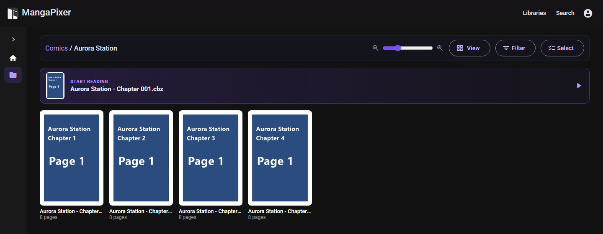

# Library layout

MangaPixer is folder-native. **Your folder tree is the library.** There is no separate metadata database to curate, nothing is renamed or reorganized, and what you see in the app mirrors what is on disk.

## How folders and archives map to the app

A library is one folder you register as an admin. Inside it:

- Every **folder** becomes a folder card you can open. Empty folders show up too; they read "This folder is empty."
- Every **supported archive** becomes a readable item. Selecting it opens the [reader](reader.md).
- Everything else (loose images, text files, PDFs) is ignored.

Names come straight from the file system. An archive's name is its full file name, extension included (`Chapter 001.cbz`). Embedded metadata such as `ComicInfo.xml` is not read.

There is no special "series" or "chapter" type. By convention a series is a folder and a chapter or volume is an archive inside it, at any depth:

```text
/media/manga                      <- library root
├── Some Series/                  <- folder card ("series")
│   ├── Vol 01/                   <- nested folder
│   │   ├── Chapter 001.cbz       <- readable item ("chapter")
│   │   └── Chapter 002.cbz
│   └── Vol 02/
│       └── Chapter 003.cbz
├── Another Series/
│   ├── Chapter 001.cbr
│   └── Chapter 002.cbr
└── A One-shot.cbz                <- archives can sit at any level, including the root
```



Structure matters in two places:

- **Next/previous chapter** in the reader moves between archives in the *same folder*. It does not cross into a sibling folder, so `Vol 01` does not continue into `Vol 02`.
- **Folder covers** use the first archive found anywhere below the folder, using the Name order described below, so a folder that only contains subfolders still gets a cover. To pick a folder's cover yourself, give an archive a name that sorts first. For example, `@000.cbz` sorts ahead of `Chapter 001.cbz`.

## Supported archive formats

| Extensions | Format | Readable |
|---|---|---|
| `.cbz`, `.zip` | ZIP | Yes |
| `.cbr`, `.rar` | RAR 4 and RAR 5 | Yes, unless the archive is *solid* |
| `.cb7`, `.7z` | 7-Zip | **Not yet.** They are scanned and listed, but pages cannot be opened (see below). |

- The scanner picks files by extension, ignoring case. When a file is opened, its real format is detected from its content, so a `.cbr` that is really a ZIP still works.
- **Solid archives** (a compression mode where files can only be unpacked in sequence) cannot be read yet. The server treats every 7-Zip archive as solid, which is why `.cb7` and `.7z` do not open. Page requests for them fail with "Solid archives are not yet supported for reading." Repack them as `.cbz` to read them.
- **Password-protected archives** cannot be opened. The reader says "This archive is password-protected."
- **Not supported:** `.cbt`/tar, PDF, EPUB, and folders of loose images. A folder that only holds images appears as an empty folder.
- An archive can hold up to 50,000 entries and 32 GiB of uncompressed data.

## Pages inside an archive

- **Image formats:** `.jpg`, `.jpeg`, `.png`, `.webp`, `.avif`, `.gif`, `.bmp`, `.tif`, `.tiff` (by extension, ignoring case).
- **Ignored entries:** anything else, plus `__MACOSX/` folders, files starting with `._`, `Thumbs.db`, `.DS_Store` and `ComicInfo.xml`.
- **Folders inside the archive are fine.** Pages are ordered by their full path inside the archive, so `vol1/001.png` comes before `vol2/001.png`.
- **Page order is natural order**, described next. The order the files were stored in the archive does not matter.

## Sorting

MangaPixer sorts names in **natural order**. The same rules apply to pages inside an archive and to folders and archives in the library view.

### The rules

- Runs of digits compare as numbers: `Chapter 2` < `Chapter 10`, `page2.png` < `page10.png`.
- Equal numbers with different zero-padding put the longer padding first: `001` < `01` < `1`.
- Letters compare by character code, so uppercase comes before lowercase (`Cover.png` < `cover.png`) and there is no language-specific collation.
- Digits sort before letters: `10 Tigers` < `Akira`.
- Decimals work the way you expect for volume numbers: `Vol.1.5` < `Vol.2`.

### Pages

Page files inside an archive sort by these rules on their full path inside the archive.

### Folders and archives

In the library view, **Name** sort applies the same rules. This affects browsing, next/previous chapter, folder covers, the pinned Continue row and the A–Z jump rail:

| On disk | Shown in Name order |
|---|---|
| `Chapter 1.cbz`, `Chapter 2.cbz`, `Chapter 10.cbz` | `Chapter 1`, `Chapter 2`, `Chapter 10` |
| `Chapter 001.cbz`, `Chapter 002.cbz`, `Chapter 010.cbz` | `Chapter 001`, `Chapter 002`, `Chapter 010` |

Zero-padding your numbers is no longer necessary for them to sort correctly. It is still harmless, and padded and unpadded names sort the same way, so an existing padded collection is unaffected.

With Name ascending, folders come before archives. With Name descending, the whole list is reversed, so archives come first.

### Browse sort, order and filters

The **View** button (tooltip "Change how the library is displayed") holds:

- **Card** or **List** view, plus a **Card size** slider.
- **Sort by:**
  - **Name.** Natural order, as above. **Order** can be **Ascending** or **Descending**.
  - **Recently added** ("New items appear"). Newest first, by when the server first found the item, not the file's modification date. Folders are listed first.
  - **Recently read.** Your own reading activity, newest first, with folders and archives mixed. A folder counts activity anywhere below it.
  - **Recently updated** ("Folders with new content"). Folders rank by the newest archive added anywhere below them, mixed with archives. Useful for spotting series that received new chapters.

The recency sorts are always newest first and have no Order option. Your sort choice is saved to your account.

The **Filter** button holds:

- **Show:** **All**, **Reading**, **Read** or **Unread**. For folders, the filter looks at every archive below them.
- **Hide empty folders:** hides folders with no archive anywhere below them.

- **Favorites only:** shows only the folders and archives you starred.

Filters apply to the current view only and are not saved.

### Selecting items

Choose **Select** to pick several items for a bulk action, such as marking them read or (for admins) setting a reading direction. In **List** view you can also tick the checkbox on any row directly, without choosing **Select** first; tapping the row itself still opens it. See [Read and unread](reader.md#read-and-unread) for the selection shortcuts.

### Jump navigation

At the library root, sorted by Name ascending with no filter active, a **jump rail** appears (on phones, an **A-Z** button that opens a letter picker). It groups the top-level entries by their first character:

- `#` for names starting with a digit.
- `A`–`Z` for Latin letters. Accented letters such as `É` go to **Other**.
- Script groups for other writing systems: **Kana**, **Hangul**, **CJK**, **Cyrillic**, **Greek**, **Arabic**, **Hebrew**, **Thai**.
- **Other** for everything else.

Leading punctuation, brackets and spaces are skipped, so `(Title)` and `-Title-` file under `T`. Each chip shows how many entries it holds. Selecting it scrolls to the first one.

## Favorites

Star any folder or archive to keep it within easy reach. The star appears on cards and rows in the library view, on search results, and in the reader toolbar (for the chapter you are reading).

- **Favorites** in the sidebar, above your libraries, lists everything you starred, most recently starred first.
- **Favorites only** in the **Filter** menu narrows any library view to your starred items.
- Two options in **Settings** > **Favorites**, both off by default: a **Favorites** row on the home page, and highlighting starred results in search (a star badge, and they move to the top).

Favorites belong to your account and follow you to every device. They respect Private libraries: while Incognito is on, favorites in your Private libraries are hidden too.

## Rescans, moves and deletions

**Scans only run when an admin starts one.** There is no schedule, no scan at start-up and no file watcher. Registering a library does not scan it either. In **MangaPixer Administration** > **Libraries**:

- **Scan now** (the circular-arrow icon) on a library's row scans that library.
- **Scan all libraries** scans every library. Libraries that are already scanning are skipped.
- **Cancel** stops a running scan.
- The palette icon opens an **icon picker** so you can give a library a distinct glyph instead of a name-derived default badge.

After a scan, new archives are analyzed in the background. Their page counts and covers fill in over the next moments.

**What a rescan does:**

- **New files and folders** are added.
- **Changed files** (different size or modification time) are re-analyzed and get a new cover. Reading progress is kept.
- **Deleted files and folders** disappear from the library once the scan completes. If a file comes back at the same path, it reappears with its progress intact.
- **Moved or renamed archives** keep their identity: reading progress, read marks, bookmarks and thumbnail follow the file to its new location. MangaPixer recognizes a moved file by a content signature: its size plus a hash of its first and last 64 KiB. A move is recognized only when:
  - the archive had been analyzed before it moved,
  - exactly one missing file matches exactly one new file, and
  - the new file is not still being written.

  Otherwise the moved file is treated as a new item.
- **Safety net:** if a scan finds that almost everything has vanished (for example an unmounted share), it deletes nothing. The same applies if the library folder itself is unreachable; the scan fails with "Library root is not accessible."

**What is skipped during a scan:**

- Folders whose names start with `.`.
- System and tool folders: `@eaDir`, `#recycle`, `$RECYCLE.BIN`, `System Volume Information`, `.git`, `.svn`, `.hg`, `.yacreader`, and similar.
- Files named `Thumbs.db`, `desktop.ini`, `.DS_Store`, `ComicInfo.xml`, `YACReader.ini` and `YACReaderLibrary.ini`.
- Symbolic links to folders are not followed.

## Read-only guarantee

The server never modifies, moves, renames, deletes or writes into anything inside your library folders:

- The server's file-system layer has no write operations, and it opens every source file read-only.
- Everything MangaPixer generates goes to its own storage roots instead:
  - extracted page images go to the cache (`/cache`),
  - temporary unpacking goes to scratch (`/scratch`),
  - cover thumbnails go to `/data/thumbnails`.
- The installation guides mount media with `:ro`, so the operating system enforces this as well.
- **Remove library** in the admin page deletes only MangaPixer's records and reading progress for that library. Your files are not touched.

## Thumbnails

Covers are generated from the first page of each archive, 400 px on the long edge, stored as WebP in `/data/thumbnails`. They survive restarts and cache clears. The server creates them:

- after an archive is analyzed,
- after each scan,
- in a background pass at every start-up that fills in any that are missing,
- and when you select **Regenerate thumbnails** (the image icon) on a library's row in the admin page.

If covers are missing, see [Troubleshooting](troubleshooting.md#thumbnails-are-missing).
