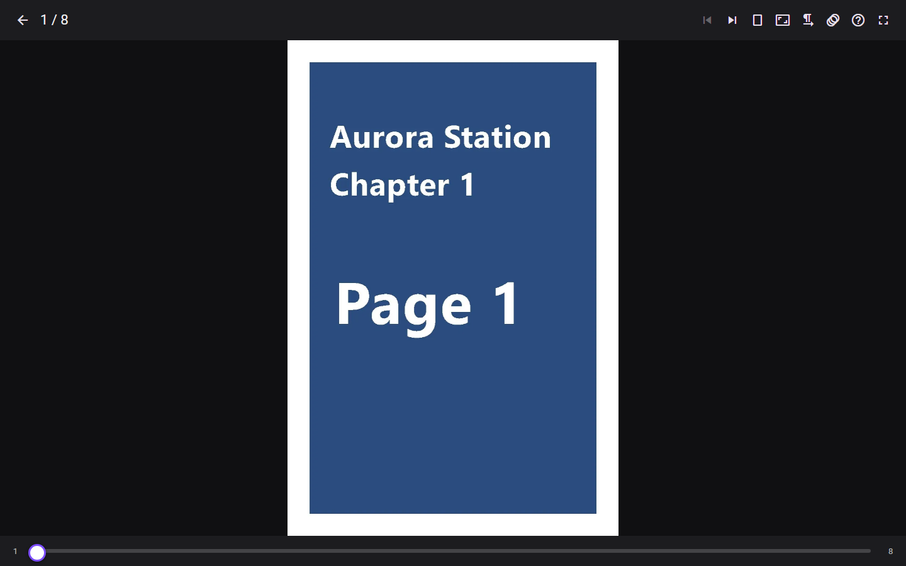
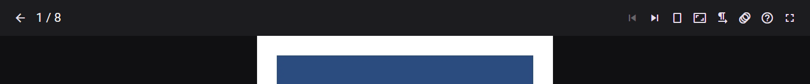
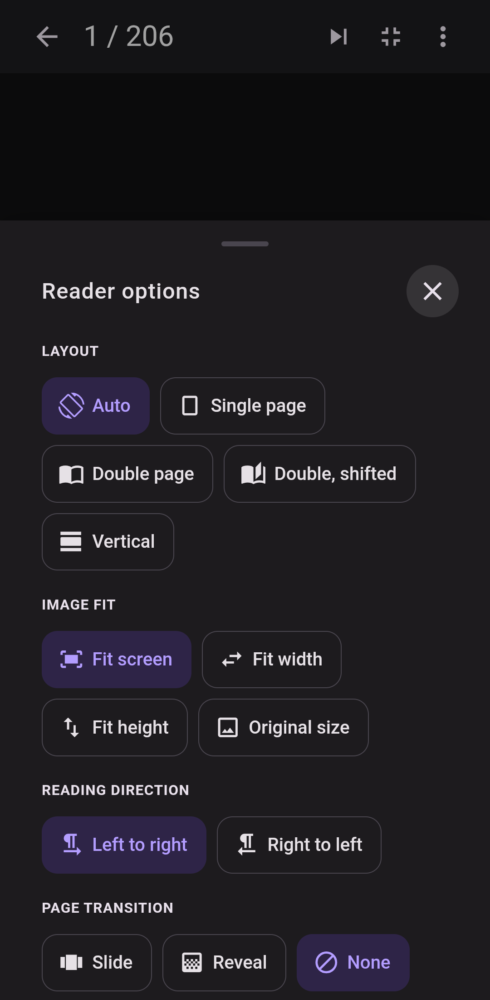
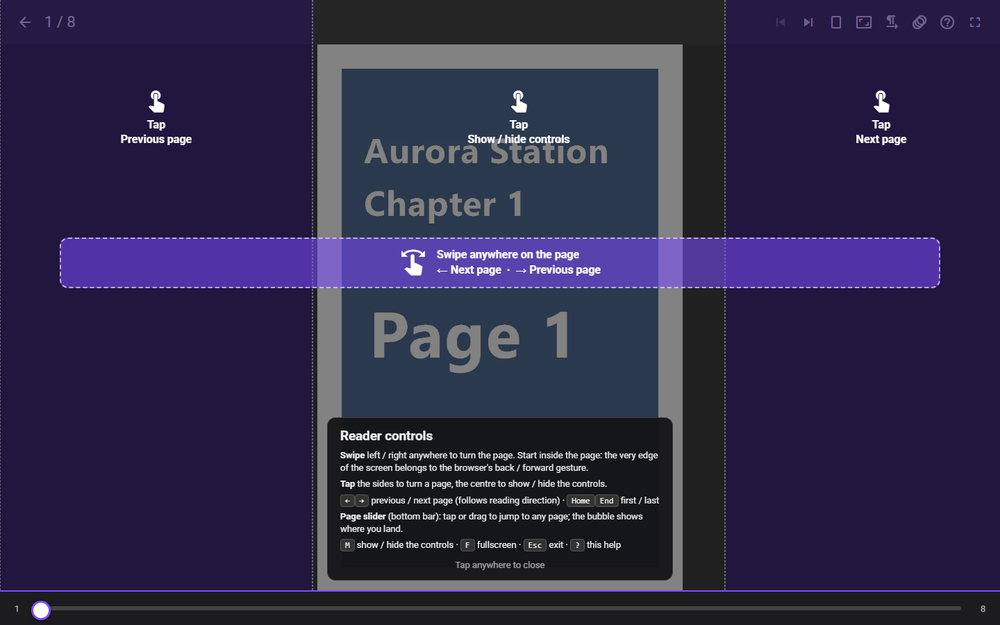

# Reader

Select any archive in a library to open it in the reader. This page covers the reader's layouts, controls and how it remembers where you are.

## Toolbar

On desktop and tablet, the toolbar at the top holds:

- **Back to folder**.
- The page counter (`12 / 40`, or `12-13 / 40` while a double page is showing).
- **Favorite** (the star): adds the open archive to your [favorites](library-layout.md#favorites).
- **Previous archive** / **Next archive**. Their tooltips name the neighboring archive. They are disabled at either end of the folder.
- **Reading mode**.
- **Image fit**, or the **Page width** slider in vertical mode.
- The reading-direction toggle.
- **Page transition**, or **Tap to scroll** in vertical mode.
- **Upscaling** (the magic-wand icon): the picture-quality options described in [Image quality](#image-quality).
- **Reading help** (`?`).
- **Fullscreen**.

In a normal window the controls stay visible. In fullscreen they hide after 3 seconds without input. Tap the center of the page, press `m`, or (with a mouse) move to the top of the screen to bring them back.

The bottom bar has a **page slider**: tap to jump, or drag to scrub, with a bubble showing where you will land. When the controls are hidden, a thin progress line shows how far through the archive you are.

### Fullscreen on iPad and iPhone

In Safari, **Fullscreen** switches the reader to its own immersive in-page mode instead of Safari's fullscreen: Safari's fullscreen would leave a system close button and the status bar sitting over the page, and the page has no way to hide either. Immersive mode hides the reader's own toolbar and bars the same way fullscreen does elsewhere, without any of that.

For a reader with no Safari bars at all, add MangaPixer to the Home Screen (**Share** > **Add to Home Screen**). The installed app has no browser bars and an opaque black status bar. The same goes for an app installed from Chrome on Android. In an installed app, the reader opens in immersive mode, with its own bars hidden; tap the center of the page to bring them back.

### On phones

On screens narrower than 600 px, the toolbar keeps only **Next archive**, **Fullscreen** and **Reader options** (⋮). **Reader options** opens a bottom sheet with every other setting:

- **Layout**
- **Image fit**
- **Reading direction**
- **Page transition**
- **Upscaling**, **Page quality** and **Downscale filter** (see [Image quality](#image-quality))
- In vertical mode, **Page width** and **Tap to scroll** replace the paged-only groups.
- **Previous archive**, **Next archive** and **Reading help**.

Changing a setting keeps the sheet open.

## Page modes

Choose a mode from **Reading mode** (on phones: **Layout**):

| Mode | Phone label | What it does |
|---|---|---|
| **Auto (orientation)** | Auto | Double page in landscape, single page in portrait. Switches live when you rotate the device or resize the window. |
| **Single page** | Single page | One page at a time. |
| **Double page** | Double page | Two pages side by side: 1-2, 3-4, … |
| **Double page (shifted)** | Double, shifted | Pairing moved by one page: the cover shows alone, then 2-3, 4-5, … Use this when a two-page spread is split across the wrong pair. |
| **Vertical (webtoon)** | Vertical | One continuous vertical strip you scroll through. |

Details:

- **Wide pages are never paired.** A page at least 1.2 times wider than it is tall (usually a scanned spread) is shown alone at full width in both double modes, and pairing restarts after it.
- **Narrow portrait screens show single pages.** If you pick a double mode on a narrow portrait screen (under 600 px wide), pages still show one at a time. Double page returns when you rotate to landscape or widen the window.
- **Your layout choice is remembered by this browser** (Auto, Single or Double). It applies to every archive you open on that device, and is not saved to your account. The double-page pairing is saved differently: see [Fixing double-page pairing](#fixing-double-page-pairing).
- **Choosing Vertical from the menu lasts for the current archive only.** To make a series always open in vertical mode, an admin sets its reading direction to **Vertical** (see [Reading direction](#reading-direction)).

### Fixing double-page pairing

Scanned releases often insert extra pages (credits, colour pages), so from some point on the pages pair up wrongly: the left half of a spread ends up next to the right half of the previous one. You can fix this anywhere in an archive:

- **Pick the other double-page mode.** The highlighted entry, **Double page** or **Double page (shifted)**, shows how the spread on screen is paired. Picking the other one shifts the pairing by one page from this spread on, up to the next wide page. On the first page this is the classic "cover alone" setting.
- **Press `o`.** The same as picking the other mode.
- **Or use `d`.** At a wrongly paired spread, press `d` for single page, go to the next page, and press `d` again: the pairing now starts at that page.

Things to know:

- **The pairing is saved for the archive, for everyone.** It is stored on the server as a property of the file, so every user who can read the archive sees the same pairing, and anyone who can read it can change it.
- **A changed file starts over.** If the archive is replaced or modified, its saved pairing is dropped.
- **Archives you have not adjusted** use the setting you last picked on the first page of an archive (cover alone or not), remembered by this browser.
- If the pairing cannot be saved (for example, you are offline), it still applies until you leave the archive, and the reader says so.

## Image fit

**Image fit** has four options:

- **Fit screen** (default): the whole page fits on screen.
- **Fit width**
- **Fit height**
- **Original size**

The fit resets to **Fit screen** each time you open the reader.

In vertical mode, **Image fit** is replaced by a **Page width** slider from 15% to 100% of the screen width. The default is 70%, and your browser remembers the setting. Pages in the strip sit edge to edge, with no gap.

## Image quality

Scanned pages rarely match your screen pixel for pixel, so every page is either shrunk or enlarged before you see it. Manga and comics are mostly line art and screentones (fine dot patterns), and both suffer when a browser resizes them with its default method: lines go soft and screentones can shimmer into moire patterns. The **Upscaling** menu (magic-wand icon; on phones, in **Reader options**) holds three settings that control this. All three are remembered by this browser, not your account.

**Page quality**

- **Auto** (default): the reader works out how large each page will actually appear on your screen, including its pixel density, and asks the server for a copy at about that size. The server shrinks the page once, with a high-quality filter, and caches the result. Pages load faster and look cleaner than when the browser shrinks a full-size scan.
- **Full**: always download the original page. Use this if you zoom in a lot, or want the exact source pixels.

The server never enlarges a page: if your screen needs more pixels than the scan has, you get the original. Animated pages are always sent as they are.

**Downscale filter** (Auto page quality only)

How the server shrinks a page:

| Filter | Look | Good for |
|---|---|---|
| **Sharp** | Crispest lines; may show moire on screentones | Clean digital releases with little screentone |
| **Balanced** (default) | A middle ground between the other two | Most scans |
| **Soft** | Smoothest screentones; lines slightly softer | Heavily screentoned print scans |

Press `s` to cycle through the filters while reading. With **Full** page quality nothing is shrunk, so the filter is greyed out ("Applies to Auto page quality").

**Upscaling**

What happens when a page is shown *larger* than its original resolution (a small or old scan on a big or high-density screen). Pages that are not being enlarged are always left to the browser, and nothing is ever sent to the server: the work happens on your device's graphics chip.

- **Smooth**: the browser's normal image scaling. No extra work, works everywhere.
- **Crisp** (default): AMD FidelityFX Super Resolution 1 (FSR 1): an edge-aware upscale plus a light sharpening pass. Cheap on battery, and it works on almost any device, over plain `http://` too.
- **Enhance**: Anime4K, an upscaler designed for anime and line art. It restores and redraws lines and screentones for the sharpest result, at more graphics work than Crisp.

Which graphics engine runs what:

| Choice | Runs on | Needs |
|---|---|---|
| **Crisp** | WebGL2 | Any browser with WebGL2 (almost all). Works over plain `http://`. |
| **Enhance** | WebGPU when the browser offers it | A secure connection: HTTPS, or `localhost` on the computer running MangaPixer. |
| **Enhance** | WebGL2 otherwise (for example over plain `http://<LAN address>`) | WebGL2 with float render targets (most devices). Runs **Efficient** only. |

Browsers only offer WebGPU to secure pages, so on a phone or tablet that opens MangaPixer as `http://192.168.x.x:…` (a LAN install, Docker or Unraid without a reverse proxy, or the Windows app with **Allow LAN access**), Enhance runs on WebGL2 instead. It gives practically the same picture as WebGPU Enhance with Efficient quality; only **Max quality** needs WebGPU. For WebGPU, open MangaPixer over HTTPS (see [Reverse proxy and HTTPS](reverse-proxy-and-https.md)).

The Upscaling menu always tells you what is running: the selected choice has a small second line naming the upscaler that runs (for example "AMD FSR 1" for Crisp, "Anime4K" for Enhance, or "Anime4K (WebGL2)" when Enhance runs without WebGPU - then **Max quality** says what it needs), and a choice that cannot run on this device is greyed out with the reason ("Needs a secure connection (HTTPS)", "Graphics chip unavailable", ...). On phones, the reasons are listed under the Upscaling chips. If a choice you picked earlier (for example on HTTPS) cannot run on this connection, the reader says so once ("Enhance isn't available here - showing Smooth.") and shows the page with Smooth; your choice is kept for the next time it can run. The status line under Upscaling (also the Upscaling button's tooltip) sums up what this device offers (for example "GPU: WebGPU needs HTTPS, WebGL2 ready"); on a phone, where the choices are chips without a second line, it names the engine in use instead. If the browser can only draw WebGL in software (its graphics chip is blocked, often an old or unusual driver), Enhance is greyed out as "Graphics chip unavailable", because it would take seconds per page; Crisp still works there.

Crisp is the default until you pick something else on a device; where it cannot run, that device quietly shows Smooth (the menu says why). Enhance has the edge on some pages, but it costs several times the graphics work and battery of Crisp. Crisp and Enhance work in single page, double page and vertical modes. Press `e` to cycle Smooth, Crisp and Enhance (choices this device cannot run are skipped). Both use the graphics chip, so they can use more battery on phones and tablets; Crisp much less than Enhance.

**Enhance quality** picks how much work Enhance does in single and double page. It appears under Upscaling while Enhance is selected (not in vertical mode):

- **Efficient** (default): a lighter Anime4K network. It uses much less graphics memory and battery, and is the right choice on phones and tablets.
- **Max quality**: the heavier network Enhance used before version 1.24.0. It can be a little sharper in single and double page modes, at the cost of more graphics memory and battery. WebGPU only: when Enhance runs on WebGL2 it is greyed out and Efficient is used (your choice is kept for WebGPU).

In vertical mode Enhance always uses Efficient (your Enhance quality choice is kept for the paged modes), because it keeps many parts of the strip enhanced at once while you scroll. There, the enhanced (or sharpened) version of a page appears a moment after you stop scrolling (the plain page shows while you scroll quickly), and only pages shown more than 1.2 times larger than their original width are processed.

If the graphics chip resets twice within a minute (for example after the app spends time in the background), vertical-mode Enhance or Crisp pauses until the page is reloaded and the Upscaling status line reads "Enhance paused (GPU reset)" (or "Crisp paused"); the pages still show normally.

Enhance is built on [Anime4K](https://github.com/bloc97/Anime4K) by bloc97: on WebGPU through the [anime4k-webgpu](https://github.com/Anime4KWebBoost/Anime4K-WebGPU) port, on WebGL2 from Anime4K's own shaders. Crisp is a port of AMD's [FidelityFX Super Resolution 1](https://github.com/GPUOpen-Effects/FidelityFX-FSR). See [THIRD-PARTY-NOTICES.md](../THIRD-PARTY-NOTICES.md).

## Reading direction

The reader supports left-to-right (comics), right-to-left (manga) and vertical (webtoon) content. In right-to-left mode:

- The arrow keys swap: `←` moves forward.
- The side tap zones swap.
- Swipes are mirrored.
- The page slider fills from the right.

**Where the direction comes from.** When you open an archive, the server picks its mode from the nearest setting it finds:

1. the folder's direction,
2. then the library's direction,
3. otherwise left-to-right.

Admins set these (readers cannot):

- **Per library:** **MangaPixer Administration** > **Libraries**, the **Direction** menu on each row: **Inherit**, **Left-to-right**, **Right-to-left** or **Vertical**.
- **Per folder:** in the library view, choose **Select**, pick one or more folders, then **Direction**. The same options appear there, with **Inherit (clear)** removing the folder's own setting. Admins see a small `LTR` / `RTL` / `Vertical` chip on folders that have their own direction.

The toolbar toggle (tooltip **Right-to-left (manga)** / **Left-to-right**) flips the direction for the archive you are reading. It is not saved. The library sidebar and home cards show a small icon with each library's direction.

## Page transition

**Page transition** controls the animation when you turn a page in single or double mode:

- **Slide** (default): the new page slides in.
- **Reveal**: the new page is wiped in over the old one.
- **None**: pages change instantly.

The choice is remembered by this browser. Animations are skipped in vertical mode, while scrubbing the slider, and when the page is zoomed. They are also turned off entirely if your operating system asks for reduced motion.

## Keyboard shortcuts

| Key | Action |
|---|---|
| `←` / `→` | Previous / next page (swapped in right-to-left). At the end or start of an archive, moves to the next or previous archive. |
| `Home` / `End` | First / last page |
| `f` | Toggle fullscreen |
| `d` | Switch between single and double page. Keeps the archive's pairing; switching to double page makes the page you are on start a spread. |
| `o` | Double page: shift the pairing by one page from the current spread (saved for the archive, see [Fixing double-page pairing](#fixing-double-page-pairing)) |
| `s` | Cycle the downscale filter: Sharp, Balanced, Soft |
| `e` | Cycle Upscaling: Smooth, Crisp, Enhance (skipping any this device cannot run), in every mode |
| `m` | Show / hide the controls |
| `Esc` | Close an open menu or help. Otherwise exit fullscreen, or go back to the folder if not in fullscreen. |
| `?` | Show / hide the help overlay |

- In vertical mode only `m`, `s`, `?` and `Esc` (to close help) apply. Scroll with the mouse wheel, trackpad or the usual scroll keys.
- Shortcuts are ignored while you type in a text field.
- When the page slider has keyboard focus, the arrow keys step one page and `Home` / `End` jump to the ends.

## Touch and mouse

**Single and double page:**

- **Tap the left or right 30% of the screen** to turn the page. In right-to-left mode the sides swap.
- **Tap the center** to show or hide the controls.
- **Swipe left or right anywhere on the page** to turn the page. Start the swipe inside the page: the very edge of the screen belongs to the browser's back/forward gesture. Swipes are ignored while the page is zoomed.

**Vertical mode:**

- **Scroll** freely. This is always available.
- **Tap to scroll** adds tap zones. Options: **Off**, **80%**, **90%** (default) or **100%** of a screen per step. The setting is remembered by this browser.
  - Tap the **bottom third** to move forward one step.
  - Tap the **top third** to move back one step.
  - Tap the **middle** to show or hide the controls.
  - A horizontal swipe does the same (swipe left to go forward).
- With **Tap to scroll** off, a tap anywhere shows or hides the controls.
- At the bottom of the strip, **Previous archive** and **Next archive** buttons appear. Vertical mode never moves to another archive on its own.

## Help overlay

Select **Reading help** (`?`) or press `?` to see the controls for the current mode, drawn over the page. The overlay opens automatically the first time you use the reader on each device. Tap anywhere to close it.

## Moving between archives

In single and double page mode:

- Turning past the **last page** opens the next archive in the same folder.
- Going back from the **first page** opens the previous archive, on its last page.
- A short message names the archive you moved to. At either end of the folder you see "You’ve reached the end. No next archive in this folder." or "You’re at the start. No previous archive in this folder."

"Next" follows the folder's Name order (see [Library layout](library-layout.md#folders-and-archives)). Moves between archives replace the browser history entry, so **Back** always returns to the folder.

## Loading and prefetch

The reader loads ahead so page turns feel instant:

- **Single and double page:** the next 6 pages and the previous 2.
- **Vertical:** the next 4 pages below your scroll position.
- Prefetch stays within the current archive.

While a page is still on its way (for example when the library's drive is spinning up), the reader shows a small spinner where the page will appear, and adds **Loading…** if the page has not arrived after about 3 seconds. In vertical mode each page's space is reserved and shows its own spinner; if a page fails to load, **Page N did not load - Tap to retry** asks for it again.

On the server, the page you are looking at always takes priority over prefetching, and prefetching takes priority over background work such as analyzing new archives. Extracted pages are cached (see the cache budget in [Configuration](configuration.md#storage)), so rereading is fast.

## Where you resume

The server saves your position as you read, including when you let go of the page slider. When you open an archive again:

| Archive state | Opens on |
|---|---|
| Never opened | Page 1 |
| Started, not finished | The page where you left off |
| Finished (you reached the last page) | Page 1 |
| Marked read, but you last stopped partway through | Where you left off, or page 1 if **Always open read archives from the start** is on |

**Always open read archives from the start** is in **Settings** > **Reading**. It is off by default and saved to your account.

## Read and unread

**Reaching the last page marks an archive as read.** In vertical mode, scrolling to the very bottom counts. The read mark is sticky: going back to an earlier page later does not make the archive unread again. Arriving on an archive's last page through **Previous archive** does not mark it read.

There is no mark-read button inside the reader. To mark archives or whole folders yourself, use the library view:

1. Choose **Select**.
2. Pick items. Shift-click selects a range, and on touch screens a long press offers **Select to here**. The **Select** menu also offers **Select all**, **Select all unread** and **Select all read**.
3. Choose **Mark read** or **Mark unread**, then **Done**.

- Selecting a folder applies to every archive below it, at any depth.
- **Mark unread** fully resets an archive: it clears both the read mark and your position, so it opens on page 1 next time.
- Cards show **✓ Read** or **Reading** badges. Folders show **✓ Read** when everything inside is read and **Reading** when it is partly read.
- On the home page, the **×** on a **Continue reading** card (**Remove from Continue reading**) hides it from that row without marking it read.

## Incognito and your reading history

Incognito hides the libraries you marked **Private** from Home, search and browsing. **It does not pause progress tracking.** Your position and read marks are still saved while Incognito is on, including in Private libraries. See [Users and access](users-and-access.md#private-libraries-and-incognito).
